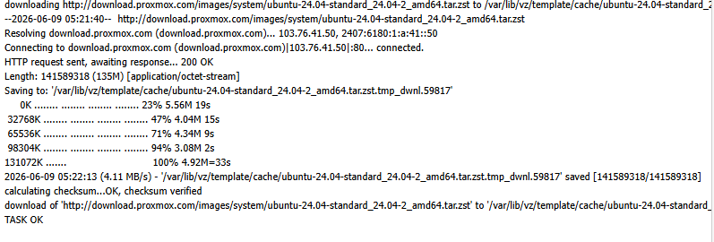
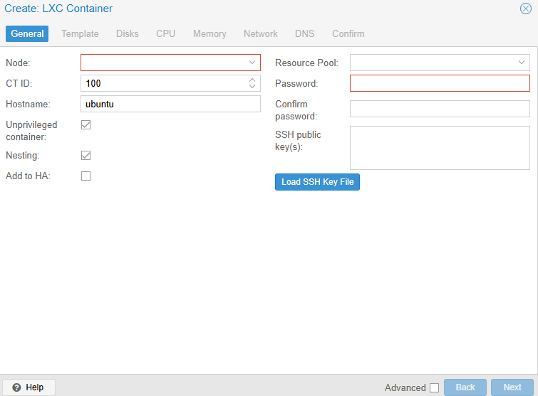
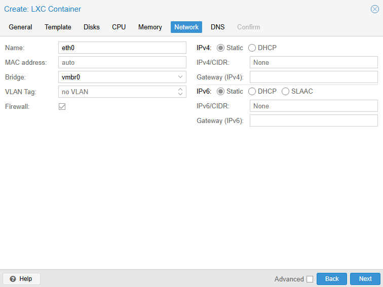
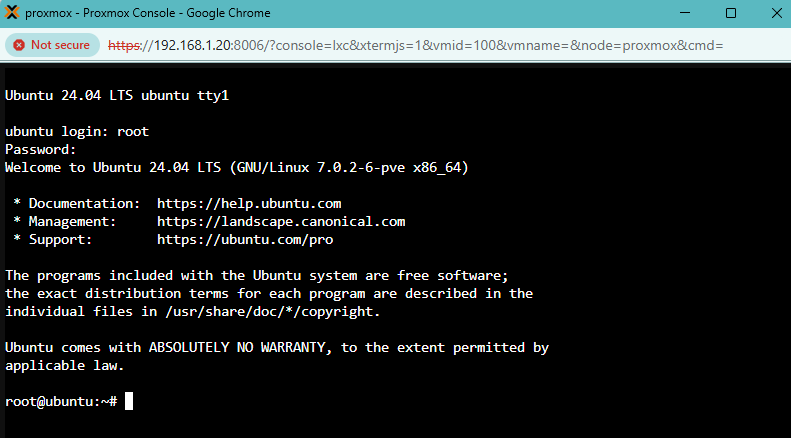
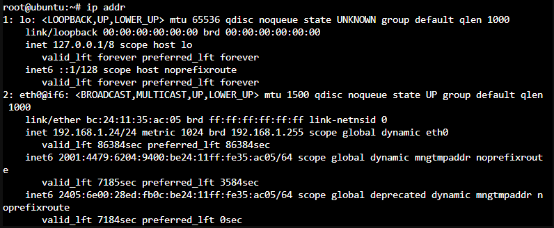
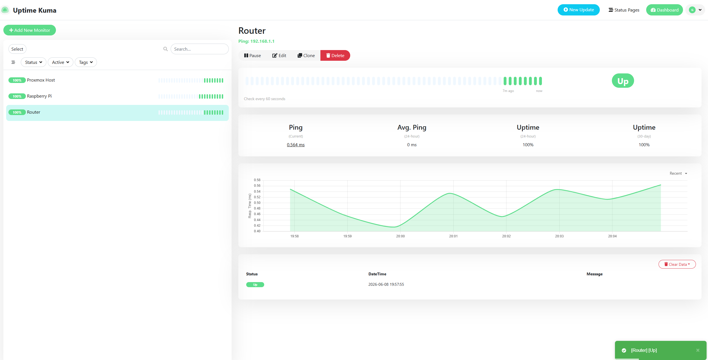
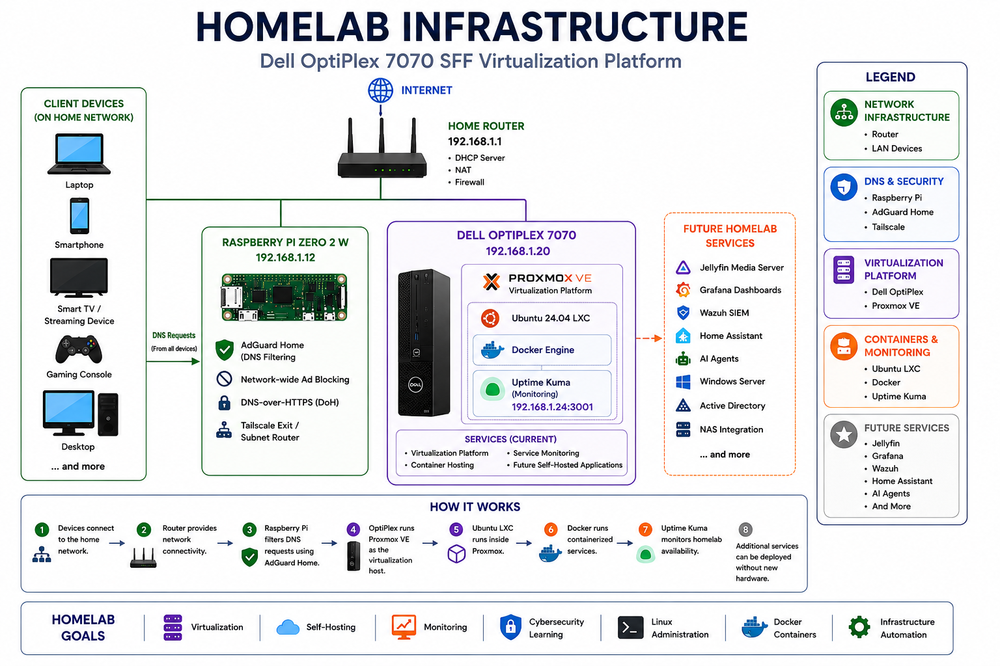

# 01 - Building My First Proxmox Homelab

## Overview

After completing several Raspberry Pi projects, including AdGuard Home and Tailscale, I wanted to take the next step and build a more capable homelab environment.

I purchased a refurbished Dell OptiPlex and converted it into a Proxmox server to learn virtualisation, Linux administration, Docker, networking, monitoring and infrastructure management.

This project marks the beginning of my homelab journey and will serve as the foundation for future projects involving Grafana, Active Directory, Wazuh, Docker services and cybersecurity labs.

---

## Objectives

The goals for this project were:

* Learn Proxmox VE
* Understand virtualisation concepts
* Create and manage Linux containers
* Deploy Docker workloads
* Implement infrastructure monitoring
* Build a platform for future cybersecurity projects

---

## Hardware

### Dell OptiPlex 7070 SFF

Specifications:

* Intel Core i7 (9th Generation)
* 16GB RAM
* 512GB SSD
* Gigabit Ethernet

The OptiPlex was chosen because it provides significantly more resources than a Raspberry Pi while remaining affordable and power efficient.

---

## Installing Proxmox VE

The first step was creating a bootable USB drive and installing Proxmox VE onto the OptiPlex.

Once installation was complete, the server was accessible through the Proxmox web interface.

---

## Networking Challenges

After installation, Proxmox booted successfully but was initially unreachable from other devices on the network.

### Incorrect Subnet

The host had been configured with:

```text
192.168.100.20
```

while my home network uses:

```text
192.168.1.x
```

The network configuration was corrected by modifying:

```bash
/etc/network/interfaces
```

and updating the address to:

```text
192.168.1.20/24
```

### DNS Resolution Failure

Although the Proxmox host could reach the router, it could not resolve domain names.

Attempting to download Ubuntu templates resulted in:

```text
Temporary failure in name resolution
```

After correcting the DNS configuration, internet connectivity and template downloads worked correctly.

This troubleshooting process helped me better understand the difference between:

* Network connectivity
* Routing
* DNS resolution

---

## Downloading an Ubuntu Template

After networking was fixed, I downloaded the Ubuntu 24.04 LXC template from the Proxmox repository.



---

## Creating an Ubuntu LXC Container

Once Proxmox networking was functioning correctly, I created my first Ubuntu LXC container.

Container configuration:

```text
Ubuntu 24.04
2 CPU Cores
2GB RAM
16GB Storage
DHCP Networking
```

### Container Creation



### Network Configuration



---

## First Successful Container

After deployment, the Ubuntu container booted successfully.



The container received an IP address from the home network using DHCP.



This was my first experience working with Linux containers and understanding how they differ from traditional virtual machines.

---

## Installing Docker

Inside the Ubuntu container, Docker was installed using:

```bash
apt update
apt install -y docker.io
```

Verification:

```bash
docker --version
```

Docker will be used to deploy and manage future self-hosted services within the homelab.

---

## Deploying Uptime Kuma

The first Docker workload deployed was Uptime Kuma.

Uptime Kuma provides a monitoring dashboard for infrastructure and services.

Current monitors include:

* Raspberry Pi
* Proxmox Host
* Router



This provides immediate visibility into the health and availability of key devices within the homelab.

---

## Current Architecture



---

## Key Lessons Learned

This project provided hands-on experience with:

* Proxmox VE
* Linux administration
* LXC containers
* Docker
* DNS troubleshooting
* Network configuration
* Infrastructure monitoring
* Virtualisation concepts

One of the most valuable lessons was understanding that successful network connectivity does not necessarily mean DNS is functioning correctly.

---

## Future Plans

Planned additions to the homelab include:

* Grafana
* Additional Docker services
* Tailscale integration
* Active Directory lab
* Windows Server virtual machines
* Wazuh SIEM
* Jellyfin
* Centralised storage

---

## Conclusion

Building this Proxmox homelab transformed a refurbished Dell OptiPlex into a capable virtualisation platform and provided practical experience with infrastructure technologies commonly used in enterprise environments.

This project forms the foundation for future self-hosted services, cybersecurity labs and continued learning in Linux, networking and virtualisation.
