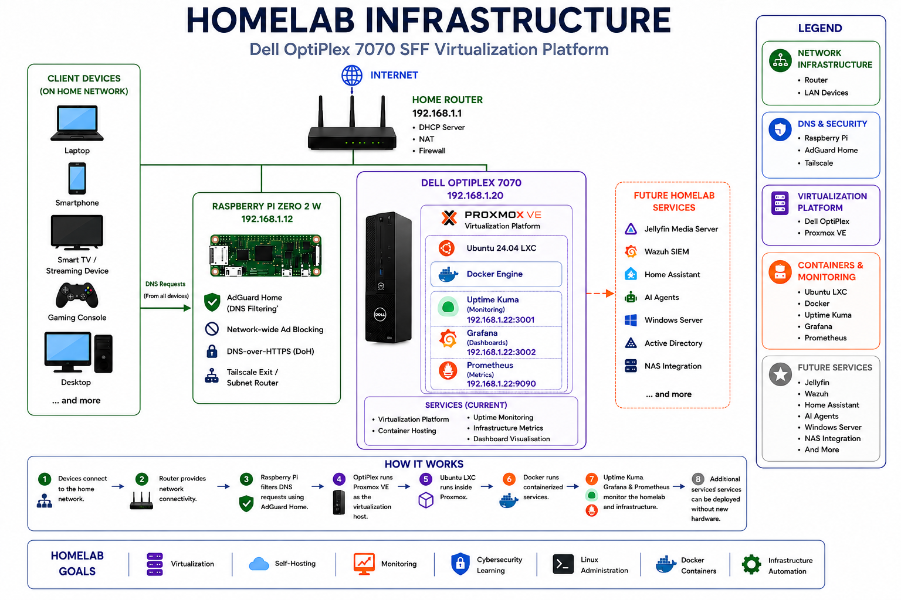
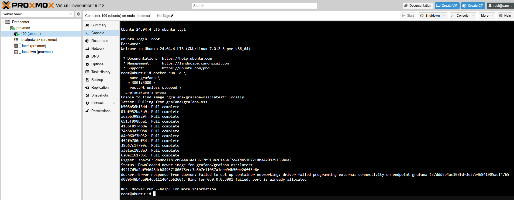
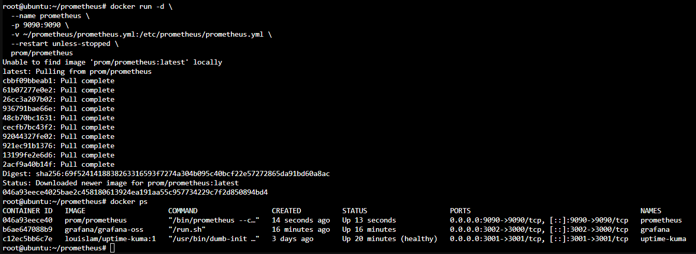
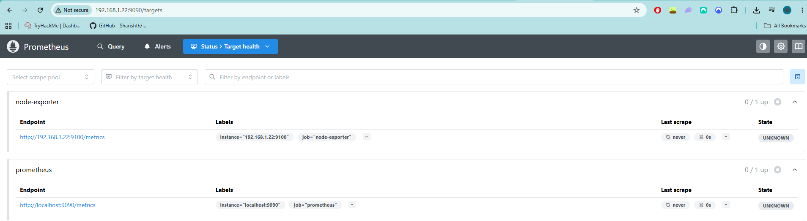
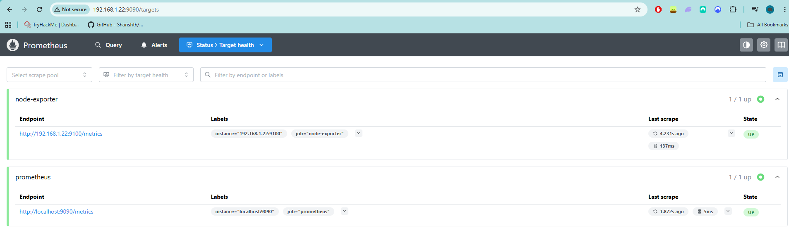
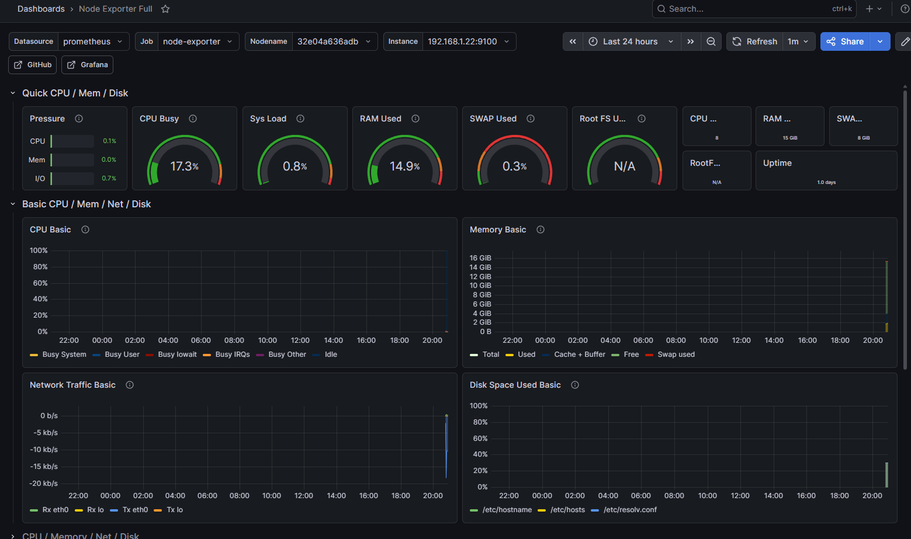

# 02 - Infrastructure Monitoring with Grafana & Prometheus

## Overview

After deploying Proxmox, Ubuntu LXC containers and Uptime Kuma, the next step in my homelab journey was implementing infrastructure monitoring.

The goal was to gain visibility into system performance, resource utilisation and overall infrastructure health using Prometheus and Grafana.

This project introduced concepts such as metrics collection, time-series databases, observability and dashboard visualisation.

---

## Architecture



The monitoring stack consists of:

- Ubuntu 24.04 LXC Container
- Docker Engine
- Prometheus
- Grafana
- Node Exporter

---

## Objectives

The goals for this project were:

- Learn infrastructure monitoring concepts
- Deploy Prometheus
- Deploy Grafana
- Collect Linux system metrics
- Create monitoring dashboards
- Build a foundation for future observability projects

---

## Existing Environment

Before deploying the monitoring stack, the homelab consisted of:

- Dell OptiPlex 7070
- Proxmox VE
- Ubuntu 24.04 LXC
- Docker
- Uptime Kuma
- Raspberry Pi Zero 2 W
- AdGuard Home
- Tailscale

The monitoring stack would be deployed alongside existing Docker services.

---

## Deploying Grafana

Grafana was deployed inside Docker using the official Grafana container image.

### Initial Challenge

The first deployment attempt failed.

Docker returned:

```text
Bind for 0.0.0.0:3001 failed:
port is already allocated
```

This occurred because Uptime Kuma was already using port 3001.



### Resolution

Grafana was redeployed using port 3002.

```text
192.168.1.22:3002
```

After updating the port mapping, Grafana launched successfully.

---

## Deploying Prometheus

Prometheus was deployed using Docker and configured with a custom `prometheus.yml` file.

The container started successfully and began exposing the Prometheus web interface.



Prometheus was configured to scrape:

- Itself
- Node Exporter

---

## Node Exporter Integration

Node Exporter was deployed to expose Linux host metrics.

These metrics include:

- CPU usage
- Memory usage
- Disk utilisation
- Network traffic
- System uptime

### Initial Issue

When Prometheus was first configured, targets appeared as:

```text
UNKNOWN
```



After troubleshooting the Node Exporter configuration and connectivity, Prometheus successfully scraped the metrics endpoint.

### Successful Configuration

Targets eventually reported:

```text
UP
```



This confirmed Prometheus was successfully collecting metrics.

---

## Connecting Grafana

Grafana was connected to Prometheus as a data source.

This allowed collected metrics to be visualised using dashboards.

The first dashboard imported was:

```text
Node Exporter Full
```

which provides a comprehensive overview of:

- CPU usage
- Memory usage
- Network activity
- Disk utilisation
- Load averages
- Uptime

---

## Dashboard Visualisation

After importing the dashboard and connecting Prometheus, Grafana began displaying live infrastructure metrics.



The dashboard now provides real-time visibility into the Ubuntu LXC container running inside Proxmox.

---

## What I Learned

This project provided hands-on experience with:

- Grafana
- Prometheus
- Docker networking
- Linux monitoring
- Metrics collection
- Infrastructure observability
- Dashboard creation
- Troubleshooting container deployments

One of the most valuable lessons was understanding the difference between service availability monitoring and infrastructure monitoring.

Uptime Kuma tells me whether a service is online.

Prometheus and Grafana tell me how that service is performing.

---

## Current Monitoring Stack

```text
Dell OptiPlex 7070
└── Proxmox VE
    └── Ubuntu 24.04 LXC
        ├── Docker
        ├── Uptime Kuma
        ├── Prometheus
        ├── Grafana
        └── Node Exporter
```

---

## Future Improvements

Planned additions include:

- Monitoring Proxmox host metrics
- Monitoring Raspberry Pi resources
- Grafana alerting
- Wazuh integration
- Loki log aggregation
- Centralised observability dashboards

---

## Conclusion

Deploying Grafana and Prometheus transformed the homelab from simple uptime monitoring into a true observability platform.

This project provided practical experience with technologies widely used in enterprise environments and created a strong foundation for future cybersecurity, infrastructure and monitoring projects.
