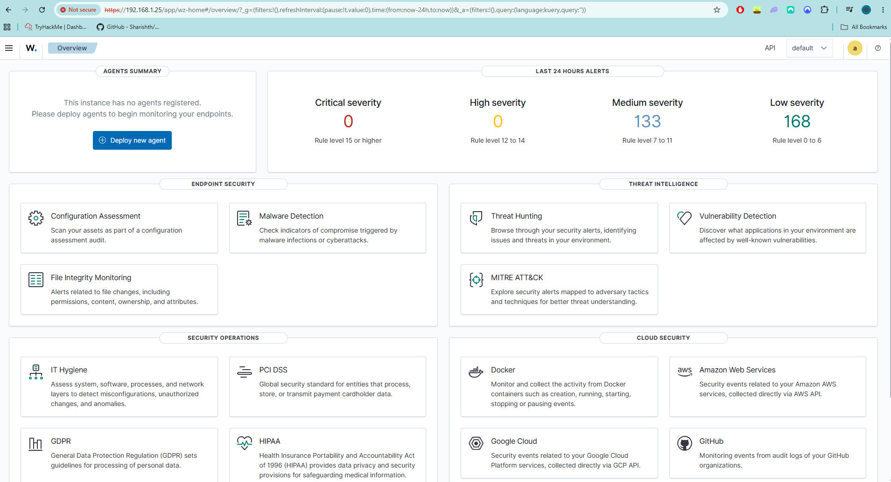
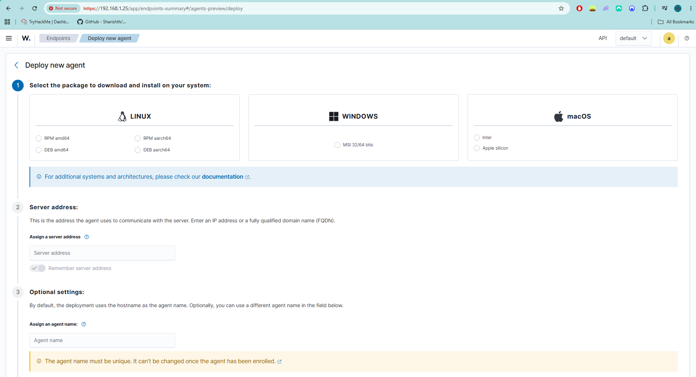
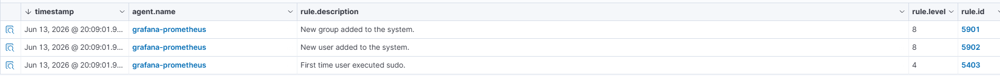
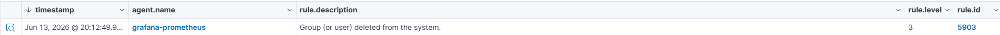
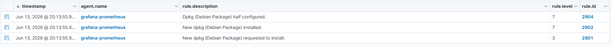

# 03 - Security Monitoring with Wazuh SIEM

## Overview

After deploying Proxmox, Ubuntu LXC containers, Uptime Kuma, Prometheus and Grafana, the next step in my homelab journey was implementing security monitoring.

The goal was to gain visibility into endpoint activity, system changes and security-relevant events using Wazuh SIEM.

This project introduced concepts such as SIEM deployment, endpoint monitoring, log collection, alert generation and SOC-style investigation workflows.

---

## Architecture

The Wazuh lab consists of:

* Dell OptiPlex 7070 SFF
* Proxmox VE
* Ubuntu Server 24.04 VM
* Wazuh Manager
* Wazuh Indexer
* Wazuh Dashboard
* Ubuntu 24.04 LXC monitored with a Wazuh Agent
* Docker services running Grafana, Prometheus, Node Exporter and Uptime Kuma

```text
Dell OptiPlex 7070 SFF
└── Proxmox VE
    ├── Ubuntu 24.04 VM
    │   └── Wazuh SIEM
    │       ├── Wazuh Manager
    │       ├── Wazuh Indexer
    │       └── Wazuh Dashboard
    │
    └── Ubuntu 24.04 LXC
        ├── Docker
        ├── Grafana
        ├── Prometheus
        ├── Node Exporter
        ├── Uptime Kuma
        └── Wazuh Agent
```

---

## Objectives

The goals for this project were:

* Deploy Wazuh SIEM in a dedicated VM
* Learn basic SIEM concepts
* Connect a Linux endpoint to Wazuh
* Monitor user account changes
* Monitor package installation activity
* Investigate alerts in the Wazuh dashboard
* Build a foundation for future SOC and detection engineering projects

---

## Existing Environment

Before deploying Wazuh, the homelab consisted of:

* Dell OptiPlex 7070 SFF
* Proxmox VE
* Ubuntu 24.04 LXC
* Docker
* Uptime Kuma
* Prometheus
* Grafana
* Node Exporter
* Raspberry Pi Zero 2 W
* AdGuard Home
* Tailscale

Wazuh was deployed as the next layer of the homelab to add security monitoring and endpoint visibility.

---

## Deploying Wazuh

Wazuh was deployed on a dedicated Ubuntu Server 24.04 VM inside Proxmox.

The VM was configured with:

```text
VM Name: wazuh-siem
CPU: 4 cores
Memory: 6GB RAM
Disk: 80GB
Operating System: Ubuntu Server 24.04 LTS
Network: VirtIO bridged adapter
IP Address: 192.168.1.25
```

Wazuh was installed using the all-in-one deployment method, which installs the core Wazuh components:

* Wazuh Manager
* Wazuh Indexer
* Wazuh Dashboard

After installation, the dashboard was accessible from the browser.

```text
https://192.168.1.25
```



---

## Deploying the Wazuh Agent

The first monitored endpoint was my existing Ubuntu LXC running Grafana, Prometheus, Node Exporter and Uptime Kuma.

The endpoint details were:

```text
Agent Name: grafana-prometheus
Operating System: Ubuntu 24.04.4 LTS
IP Address: 192.168.1.22
Wazuh Agent Version: 4.14.5
```

The Wazuh agent was deployed using the **Deploy new agent** workflow inside the Wazuh dashboard.

After installation, the endpoint successfully connected to the Wazuh manager and appeared as active.



This confirmed that logs from the Ubuntu LXC were being collected and sent to the Wazuh SIEM.

---

## User Creation Detection

To test whether Wazuh could detect Linux account management activity, I created a test user on the monitored Ubuntu LXC.

```bash
useradd hacker
```

Wazuh successfully generated alerts for:

```text
New group added to the system
New user added to the system
First time user executed sudo
```



This confirmed that Wazuh was detecting account creation and privilege-related activity from the monitored endpoint.

---

## User Deletion Detection

Next, I deleted the test user from the Ubuntu LXC.

```bash
userdel hacker
```

Wazuh generated an alert showing that a group or user had been deleted from the system.



This demonstrated that Wazuh was able to detect both user creation and user deletion events.

---

## Package Installation Detection

To test package monitoring, I installed `nmap` on the monitored endpoint.

```bash
apt install nmap -y
```

Wazuh detected Debian package activity and generated alerts such as:

```text
New dpkg requested to install
New dpkg installed
Dpkg half configured
```



This confirmed that Wazuh was monitoring package installation activity through Linux system logs.

---

## Docker Monitoring Investigation

The monitored Ubuntu LXC also runs several Docker containers:

```text
Grafana
Prometheus
Node Exporter
Uptime Kuma
```

Initially, I tried restarting Prometheus as a system service:

```bash
systemctl restart prometheus
```

This failed because Prometheus was not running as a native Linux service. It was running as a Docker container.

The correct command was:

```bash
docker restart prometheus
```

This helped reinforce the difference between systemd-managed services and Docker containers.

I also enabled the Wazuh Docker listener in the Wazuh agent configuration file:

```bash
/var/ossec/etc/ossec.conf
```

The following block was added:

```xml
<wodle name="docker-listener">
  <disabled>no</disabled>
  <interval>10m</interval>
  <attempts>5</attempts>
  <run_on_start>yes</run_on_start>
</wodle>
```

After restarting the Wazuh agent, the logs confirmed that the Docker listener started successfully:

```text
Module docker-listener started.
Starting to listening Docker events.
```

Docker event visibility in the dashboard still requires further testing, but the Docker listener was successfully enabled on the endpoint.

---

## Detection Results

| Activity                              | Result                   |
| ------------------------------------- | ------------------------ |
| Wazuh dashboard deployed              | Successful               |
| Linux endpoint connected              | Successful               |
| User creation detected                | Successful               |
| Group creation detected               | Successful               |
| User deletion detected                | Successful               |
| Sudo activity detected                | Successful               |
| Package installation detected         | Successful               |
| Wazuh agent lifecycle events detected | Successful               |
| Docker listener enabled               | Successful               |
| Docker event visibility in dashboard  | Further testing required |

---

## What I Learned

This project provided hands-on experience with:

* Wazuh SIEM
* Wazuh agent deployment
* Linux endpoint monitoring
* Security event collection
* Alert investigation
* User account monitoring
* Package installation monitoring
* Docker monitoring basics
* Troubleshooting Linux services and containers

One of the most valuable lessons was understanding how endpoint activity flows into a SIEM.

When a user was created, deleted or when a package was installed, the activity was logged on the Ubuntu endpoint, collected by the Wazuh agent, sent to the Wazuh manager and displayed as alerts in the dashboard.

This helped me understand the basic workflow used in security operations:

```text
Endpoint activity
        ↓
Log collection
        ↓
Rule matching
        ↓
Alert generation
        ↓
Investigation
```

---

## Challenges Faced

### Docker vs System Services

One challenge was understanding why Prometheus could not be restarted using `systemctl`.

The error occurred because Prometheus was not installed as a Linux service. It was running inside Docker.

This helped clarify the difference between:

```text
systemd services
Docker containers
SIEM log visibility
```

---

### Docker Event Visibility

Another challenge was Docker monitoring.

Wazuh successfully loaded the Docker listener, but Docker events did not immediately appear in the dashboard when searching for terms such as `docker` or `container`.

This showed that enabling a module and validating the visibility of events are separate steps.

---

## Current Security Monitoring Stack

```text
Dell OptiPlex 7070 SFF
└── Proxmox VE
    ├── Ubuntu Server 24.04 VM
    │   └── Wazuh SIEM
    │       ├── Wazuh Manager
    │       ├── Wazuh Indexer
    │       └── Wazuh Dashboard
    │
    └── Ubuntu 24.04 LXC
        ├── Docker
        ├── Grafana
        ├── Prometheus
        ├── Node Exporter
        ├── Uptime Kuma
        └── Wazuh Agent
```

---

## Future Improvements

Planned additions include:

* Add a Windows 11 VM as a Wazuh endpoint
* Install Sysmon on the Windows endpoint
* Forward Sysmon logs into Wazuh
* Build Windows-based detection scenarios
* Add a Windows Server VM
* Configure Active Directory
* Monitor authentication and privilege changes
* Add the Proxmox host as a monitored endpoint
* Improve Docker event visibility
* Build custom dashboards and detection use cases

The next major step will be adding a Windows endpoint with Sysmon, as this will provide richer telemetry such as process creation, PowerShell activity, registry changes and authentication events.

---

## Conclusion

Deploying Wazuh transformed the homelab from infrastructure monitoring into security monitoring.

Prometheus and Grafana provide visibility into system performance, while Wazuh provides visibility into endpoint activity and security events.

This project helped build a practical foundation for future cybersecurity work, including SIEM investigations, SOC workflows, Windows monitoring, Sysmon telemetry and Active Directory security monitoring.
